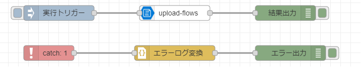

# node-red-blobstorage

## 目次

* [概要](#概要)
* [機能](#機能)
* [Deployment 設定値](#deployment-設定値)
  * [環境変数](#環境変数)
  * [Create Option](#create-option)
* [ログ出力内容](#ログ出力内容)
  * [upload-flows](#upload-flows)
  * [upload-files](#upload-files)
* [Node Specification](#node-specification)
  * [upload-flows](#Node-Specification-upload-flows)
  * [upload-files](#Node-Specification-upload-files)
* [Feedback](#feedback)
* [LICENSE](#license)

## 概要
node-red-blobstorageは、下記処理を行うNode-REDのカスタムノードです。

## 機能

Azure Blob Storageに直接もしくはAzure Blob Storage on IoT Edgeモジュールを通してフロー・ファイルをアップロードする機能。<br>
以下のノードを含む。

* upload-flows 現在のNodeREDフローのファイル(flows.json)をアップロードする。<br>


* upload-files 入力ファイルをアップロードする。<br>


## Deployment 設定値

### 環境変数

#### 環境変数の値

(なし)

### Create Option

#### Create Option の値

(なし)

## ログ出力内容

### upload-flows

| LogLevel | 出力概要 |
| -------- | -------- |
| error    | クライアント取得失敗<br>アップロード失敗     |
| warn     | 無し        |
| info     | アップロード成功 |
| debug    | 無し    |
| trace    | 無し       |

### upload-files

| LogLevel | 出力概要 |
| -------- | -------- |
| error    | クライアント取得失敗<br>アップロード失敗     |
| warn     | 無し        |
| info     | アップロード成功 |
| debug    | 無し    |
| trace    | 無し       |

## Node Specification

<a id="Node-Specification-upload-flows"></a>

### upload-flows

* 機能概要

  現在のNodeREDフローのファイルをAzure Blob Storageにアップロードする。
  アップロード後のblob上のパスは{ファイル名}(つまりflows.json)となる。

* プロパティ

  

  | プロパティ | Type        | Required | Description          |
  | ---------- | ----------- | -------- | -------------------- |
  | 名前       | string      | &nbsp;   | ノードの表示名を設定。 |
  | 接続文字列 | string      | 〇       | ストレージアカウントもしくはAzure Blob Storage on IoT Edgeモジュールの接続文字列。                   |
  | コンテナ名 | string      | 〇   | アップロード先blobコンテナ名。                    |
  | 上書き     | checkbox      | 〇   | 同名ファイルがblobに既存だった場合、上書きするかどうか。                    |

* エラー／例外

  無し

* 使用例(Azure Blob Storageに直接アップロードする場合)

  [プロパティ]

  | プロパティ | Type   | Value   |
  | ---------- | ------ | ------- |
  | 接続文字列 | string  | ストレージアカウントの接続文字列                  |
  | コンテナ名 | string  | containerA                    |
  | 上書き     | checkbox | チェックを入れる                    |

  [入力メッセージ]

  (なし。トリガーとしてのみ使用)

  [出力メッセージ]

  ```json
  {
    "_msgid":"メッセージid",
    "payload":"Upload process completed."
  }
  ```

* 使用例(Azure Blob Storage on IoT Edgeモジュールを経由してアップロードする場合)

  [プロパティ]

  | プロパティ | Type   | Value   |
  | ---------- | ------ | ------- |
  | 接続文字列 | string  | Azure Blob Storage on IoT Edgeモジュールの接続文字列<br>DefaultEndpointsProtocol=https;BlobEndpoint=http://<デバイスIP>:<モジュールPort番号>/<モジュール環境変数LOCAL_STORAGE_ACCOUNT_NAME>;AccountName=<モジュール環境変数LOCAL_STORAGE_ACCOUNT_NAME>;AccountKey=<モジュール環境変数LOCAL_STORAGE_ACCOUNT_KEY>;                 |
  | コンテナ名 | string  | containerA                    |
  | 上書き     | checkbox | チェックを入れる                    |

  [入力メッセージ]

  (なし。トリガーとしてのみ使用)

  [出力メッセージ]

  ```json
  {
    "_msgid":"メッセージid",
    "payload":"Upload process completed."
  }
  ```

<a id="Node-Specification-upload-files"></a>

### upload-files

* 機能概要

  入力ファイルをAzure Blob Storageにアップロードする。
  アップロード後のblob上のパスは{親ディレクトリ}/{ファイル名}となる。

* プロパティ

  

  | プロパティ | Type        | Required | Description          |
  | ---------- | ----------- | -------- | -------------------- |
  | 名前       | string      | &nbsp;   | ノードの表示名を設定。 |
  | 接続文字列 | string      | 〇       | ストレージアカウントもしくはAzure Blob Storage on IoT Edgeモジュールの接続文字列。                   |
  | コンテナ名 | string      | 〇   | アップロード先blobコンテナ名。                    |
  | 上書き     | checkbox      | 〇   | 同名ファイルがblobに既存だった場合、上書きするかどうか。                    |

* エラー／例外

  無し

* 使用例(Azure Blob Storageに直接アップロードする場合)

  [プロパティ]

 | プロパティ | Type   | Value   |
  | ---------- | ------ | ------- |
  | 接続文字列 | string  | ストレージアカウントの接続文字列                  |
  | コンテナ名 | string  | containerA                    |
  | 上書き     | checkbox | チェックを入れる                    |


  [入力メッセージ]

  ```json
  {
    "payload":["/data/fileNodeTest.log"]
  }
  ```

  [出力メッセージ]

  ```json
  {
    "_msgid":"メッセージid",
    "payload":"Upload process completed."
  }
  ```

* 使用例(Azure Blob Storage on IoT Edgeモジュールを経由してアップロードする場合)

  [プロパティ]

  | プロパティ | Type   | Value   |
  | ---------- | ------ | ------- |
  | 接続文字列 | string  | Azure Blob Storage on IoT Edgeモジュールの接続文字列<br>DefaultEndpointsProtocol=https;BlobEndpoint=http://<デバイスIP>:<モジュールPort番号>/<モジュール環境変数LOCAL_STORAGE_ACCOUNT_NAME>;AccountName=<モジュール環境変数LOCAL_STORAGE_ACCOUNT_NAME>;AccountKey=<モジュール環境変数LOCAL_STORAGE_ACCOUNT_KEY>;                 |
  | コンテナ名 | string  | containerA                    |
  | 上書き     | checkbox | チェックを入れる                    |

  [入力メッセージ]

  ```json
  {
    "payload":["/data/fileNodeTest.log"]
  }
  ```

  [出力メッセージ]

  ```json
  {
    "_msgid":"メッセージid",
    "payload":"Upload process completed."
  }
  ```

## Feedback
お気づきの点があれば、ぜひIssueにてお知らせください。

## LICENSE
node-red-blobstorage is licensed under the MIT License, see the [LICENSE](LICENSE) file for details.